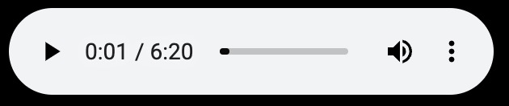
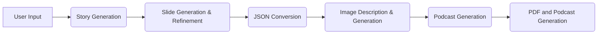

# Presento: AI Presentation and Podcast Maker

## Overview

This application leverages the power of Vertex AI Agents API and the Imagen text-to-image model to generate presentations and podcasts based on a user-provided topic. 

| [Sample PDF](./LearningtoLearn.pdf) | [Sample Podcast](./podcast-big-bang-theory.mp3) | [Try Locally](https://github.com/krishnaji/presento/tree/main?tab=readme-ov-file#getting-started) |
| ------------------------------------- | --------------------------------- | ---------------------------------------------------------------------------------------------- |
|   [Try in Notebook](./Notebook.ipynb)  |                                   |                                                                                                |


[](https://krishnaji.github.io/sample-files/podcast-big-bang-theory.mp4)

## Features

* **Vertex Agents for Content Creation:**  
    * **Story Generation:** Creates a comprehensive story related to the user's topic.
    * **Slide Generation:** Structures the story into a basic slide deck format.
    * **Slide Refinement:** Iteratively improves the slide deck's clarity, conciseness, and engagement.
    * **Image Description Generation:** Creates detailed prompts for image generation tailored to each slide's content.
    * **JSON Conversion:**  Transforms the refined slide deck text into a structured JSON format for easier processing.
    * **Podcast Generation:** Generates a podcast conversation between a host and a guest expert based on the slide content.
* **Imagen for Visuals:**  Generates relevant and engaging images for each slide based on the AI-generated descriptions.
* **PDF Generation:** Compiles the slides, including titles, descriptions, key takeaways, and images, into a downloadable PDF presentation.
* **Podcast Synthesis:** Synthesizes the generated podcast conversation using Google Cloud Text-to-Speech, with different voices for the host and guest.
* **Gradio Interface:**  Provides a user-friendly interface for topic input, refinement level selection, and presentation and podcast download.


## Architecture

1. **User Input:** The user provides a presentation topic through the Gradio interface.
2. **Story Generation:** A Gemini agent generates a detailed story relevant to the topic.
3. **Slide Generation & Refinement:** Another agent converts the story into a slide deck, which is then refined iteratively by a refinement agent.
4. **JSON Conversion:** The refined slide deck is converted to JSON format.
5. **Image Description & Generation:** An agent creates image descriptions for each slide. Imagen then uses these descriptions to generate relevant images.
6. **Podcast Generation:** An agent generates a podcast conversation based on the slide deck content.
7. **PDF and Podcast Generation:** The application creates a PDF presentation from the slides and images and synthesizes the podcast audio using Google Cloud Text-to-Speech.

## Getting Started

1. **Set up**
   - Set the `PROJECT_ID` and `LOCATION` variables in the code.
   - Enable the Vertex AI API, Text-to-Speech API.
2. **Install Dependencies:**
   ```bash
   pip install -r requirements.txt
   ```
3. **Run the Application:**
   ```bash
   gradio main.py 
   ```
4. **Deploy to Cloud Run**
```bash 
gcloud run deploy presento  --project <PROJECT_ID>  --port 8080 --region us-central1 --min-instances 1 
```
```Please note some of the services here are either private preview,public preview and GA. Please refer documentation for more details.```